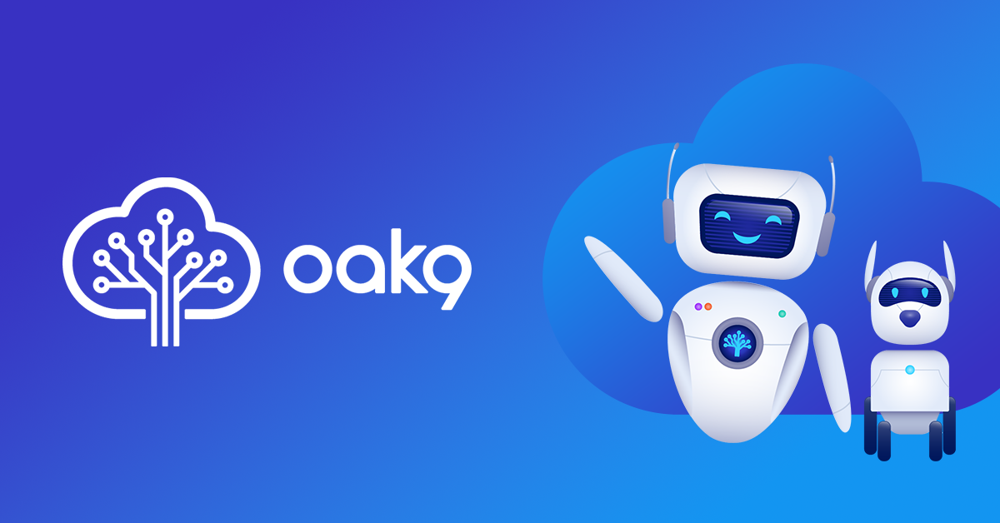

# k8s_dev_workshop

Deploying to K8's Using Argocd and Jenkins

## Table of Contents
* [Introduction](#introduction)
* [Prerequistes](#Must-Haves-Before-Starting)
* [Installation Minikube](#Getting-Started-Minikube)
* [Installation Argocd](#Getting-Started-ArgoCD)
* [Installation Jenkins](#Getting-Started-Jenkins)
* [Runnin Pipleine](#Blast-Off)

## Introduction 

This repo will will be used for Oak9 Dev workshop on how to get started with microservices on Kubernetes using ArgoCD and Jenkins.  We will walk through the instalation process and build a sample app that will deploy to minikube locally using jenkins and argocd. 

Before you proceed, WARNING:
All the installations steps have been performed on a Mac. 

## Prerequistes 

Github Account
Install helm
Install Minikube
Install Jenkins 

## Intallation Minikube
Instructions can be founde here, 
https://helm.sh/docs/intro/install/

## Intallation Minikube

Let's install Minikube first, the installation instructions can be found here, https://minikube.sigs.k8s.io/docs/start/

After helm is installed

## Installation Argocd

Now lets install argocd on our minikube cluster. Argo CD is installed within our kubernetes cluster, in a specific namespace. 

Argo CD is a pull-based deployment tool. It watches a remote Git repository for new or updated manifest files and synchronizes those changes with the cluster.

insall argocd on kubernetes 

port-forward to pod to get localhost UI access 
kubectl port-forward argocd-server-76cf7d4c7b-rv8gz  8080:8080 -n argocd

## Installation Jenkins

Now lets install Jenkins onto our minikube cluster, 

Steps: 
kubectl create namespace jenkins
kubectl get namespaces ( you should see jenkins)
helm repo add jenkinsci https://charts.jenkins.io
helm repo update
kubectl apply -f jenkins-volume.yaml
minikube ssh
sudo chown -R 1000:1000 /data/jenkins-volume (***)
kubectl apply -f jenkins-sa.yaml

## Demo setup 

Clone this repo into your own repo